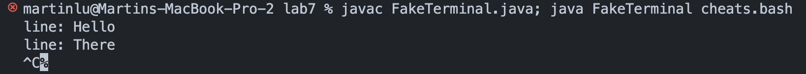

# Lab report 5 - Done Quick, Done Quicker
One of my favorite lab activities was lab 4, the Code Done Quick challenge (Despite the fact that I fell off the tournament at the first braket. [Because my commands were rendered useless by an on-the-fly class-name change <Sabotage, I say!>]). I learned a lot about bash shortcuts, vim tricks, and more. Originally, I planned to put all the commands into a bash script, publish it on github, and use curl to run it. This plan was shut down. But my deciet and trickery knows no bounds, so in this lab report, I will be creating a program which makes it appear that I am typing commands by hand, into the terminal, while really running a premade script.


## Attempt 1

I created the following bash script (cheats.sh), which condensed every command I ran into a single script:
```
git clone https://github.com/Momopey/lab7
cd lab7/
javac -cp lib/hamcrest-core-1.3.jar:lib/junit-4.13.2.jar *.java; java -cp .:lib/hamcrest-core-1.3.jar:lib/junit-4.13.2.jar org.junit.runner.JUnitCore ListExamplesTests
vim -c ':43s/index1/index2/ | write | quit ' ListExamples.java
javac -cp lib/hamcrest-core-1.3.jar:lib/junit-4.13.2.jar *.java
java -cp .:lib/hamcrest-core-1.3.jar:lib/junit-4.13.2.jar org.junit.runner.JUnitCore ListExamplesTests
git add ListExamples.java;git commit -m "fixed";git push
```

As a first attempt, created the following java class (FakeTerminal.java).
```
    import ...
    class ExecHelpers {
        ...
    }

    class FakeTerminal{
        // static String userDevice = "martinlu@Martins-MacBook-Pro-2";
        public static String makeTerminalHeader() throws UnknownHostException{
            String[] systemNameList= InetAddress.getLocalHost().getHostName().split("\\.");
            String systemName = systemNameList[0];
            String username = System.getProperty("user.name");
            String[] workingDirPath = System.getProperty("user.dir").split("/");
            String workingDir = workingDirPath[workingDirPath.length - 1];
            return username + "@"+ systemName + " " + workingDir + " % ";
        }
        public static void main(String[] args) throws IOException, InterruptedException{
            String header = makeTerminalHeader();
            String filename = args[0];
            String[] commands = ExecHelpers.exec(new String[]{"cat",filename}).split(System.lineSeparator());
            for(String command : commands){
                 System.out.println(header + command);
                String result = ExecHelpers.exec(new String[]{"exec",command});
                 String result = ExecHelpers.exec(new String[]{"bash","execscript.bash",command});
                 System.out.print(result); 
            }
        }
    }
```
The ExecHelpers class is identical to that provided for the gradescript lab.
The makeTerminalHeader method produces a string that looks like the thing to the left of the terminal prompt (For me, `martinlu@Martins-MacBook-Pro-2 lab7 %`). It does so by getting some system properties, extracting the relivant content, and sticking it together.
The output of this method is crucial for the illusion. 

The main method takes one argument - the name of a bash script file which contains the commands to run. 
I read the contents of the contents of the file by running `cat <filename>` via exec helper. Splitting by newline gives me a list of commands to run in order. Then I loop over each command, print a plausible looking term prompt. Then, using the `exec` command to run it via bash, and print the output.

The implementation had a bug, however.
Compiling, then running `java FakeTerminal cheats.bash` resulted in the following error.

Apparently it is illegal to run exec from java.

## Attempt 2 - Jailbreak exec
I then attempted to jailbreak the exec command restriction. 
I created a bash script execscript.bash, containing: `exec $1`
I then updated the FakeTerminal command running implementation
```
 for(String command : commands){
    System.out.println(header + command);
    String result = ExecHelpers.exec(new String[]{"bash","execscript.bash",command});
    System.out.print(result); 
}
```
This implementation did run commands but didn't work, because using exec to run a vim command crashed the terminal.

## Attempt 3 - Make a bash process
The vim command worked in the terminal, so I figured if I spun up a bash process in java using `bash -s`, and piped the inputs in, it would work fine. 
I rewrote the FakeTerminal command running implementation to use a live process and streams:

```
Process p = new ProcessBuilder()
        .command(Arrays.asList(new String[]{"bash","-s"}))
        .redirectErrorStream(true)
        .start();

//https://stackoverflow.com/questions/18903549/writing-to-inputstream-of-a-java-process
OutputStream stdin = p.getOutputStream();
InputStream stdout = p.getInputStream();

// BufferedReader reader = new BufferedReader(new InputStreamReader(stdout));
BufferedWriter writer = new BufferedWriter(new OutputStreamWriter(stdin)); 
Scanner scanner = new Scanner(stdout);

for(String command : commands){
    if(command.charAt(0) == '#') continue;
    System.out.println(header+command);
    writer.write(command + "\n");
    writer.flush();
    
    while(scanner.hasNextLine()) {
        String line = scanner.nextLine();
        System.out.println(line);
    }
}

writer.flush();
scanner.close();
p.destroy();
```
I directly use the ProcessBuilder constructor to spin up the `bash -s` process. I then initialised an output stream, and scanner for reading outputs.

But there was an issue with the scanner reading: apparently scanner.hasNextLine() hangs if the process is awaiting input, which happens after the command completes running. 



In order to prevent this problem, I proceeded to bodge.

```
  Process p = new ProcessBuilder()
                .command(Arrays.asList(new String[]{"bash","-s"}))
                .redirectErrorStream(true)
                .start();

//https://stackoverflow.com/questions/18903549/writing-to-inputstream-of-a-java-process
OutputStream stdin = p.getOutputStream();
InputStream stdout = p.getInputStream();

// BufferedReader reader = new BufferedReader(new InputStreamReader(stdout));
BufferedWriter writer = new BufferedWriter(new OutputStreamWriter(stdin)); 
Scanner scanner = new Scanner(stdout);

String DONE_STRING = "lkdfjnghreiugyerpifuahlriungulraeg";

for(String command : commands){
    if(command.charAt(0) == '#') continue;
    System.out.println(header+command);
    writer.write(command + "\n");
    writer.write("echo "+DONE_STRING+"\n");
    writer.flush();
    
    while(scanner.hasNextLine()) {
        String line = scanner.nextLine();
        if(line.equals(DONE_STRING)){break;}
        System.out.println(line);
    }
}

writer.flush();
scanner.close();
p.destroy();
```
I created a command terminating string DONE_STRING, which gets echo'ed after the specific command is done running. The scanner reader then checks if the read line equals DONE_STRING, to determine when to stop. Not a great solution, but works. Also, DONE_STRING should really be a nonce.

This implementation works! However, the vim script still blows everything up. 


Vim normally takes over the whole terminal, but I figured the command line option to run from terminal would prevent that. Apparently it actually just opens it, and closes it instantly, which bungles the whole live process.
The solution: Screw vim, use `sed` instead. Sed is a command which effectivley does the find and replace I wanted to do.
I then updated the cheats.sh script: 
```
rm -rf lab7/
git clone https://github.com/ucsd-cse15l-w23/lab7
cd lab7/
pwd
echo javac -cp lib/hamcrest-core-1.3.jar:lib/junit-4.13.2.jar *.java
javac -cp lib/hamcrest-core-1.3.jar:lib/junit-4.13.2.jar ListExamplesTests.java ListExamples.java
java -cp .:lib/hamcrest-core-1.3.jar:lib/junit-4.13.2.jar org.junit.runner.JUnitCore ListExamplesTests
sed '43s/index1/index2/' ListExamples.java > temp.java
cat temp.java > ListExamples.java      
rm temp.java
javac -cp lib/hamcrest-core-1.3.jar:lib/junit-4.13.2.jar *.java
java -cp .:lib/hamcrest-core-1.3.jar:lib/junit-4.13.2.jar org.junit.runner.JUnitCore ListExamplesTests
git add ListExamples.java;git commit -m "fixed";git push
```
The sed command didn't work first try. Mac is apparently fussy about overwriting files with sed, so I had to pipe the output into a temp file.

# Results
Everything works, mostly!


I think it would've been faster to just run the commands by hand.


