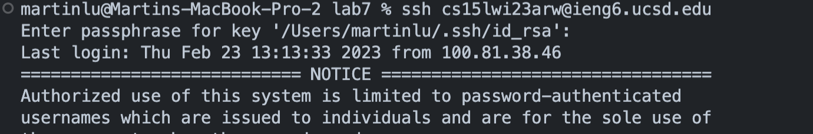
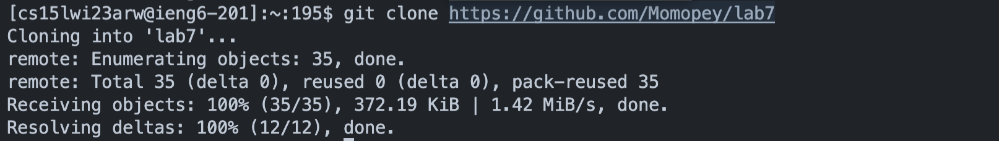
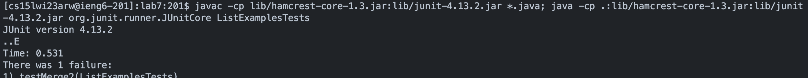
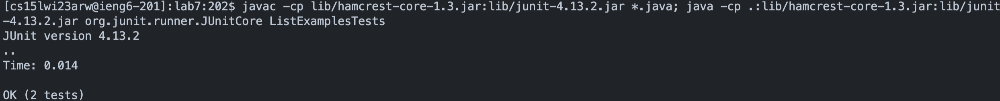
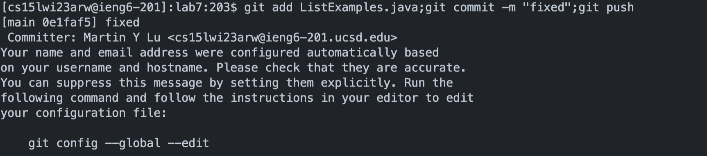

# Lab 4 -  Done Quick
## 4 - Log into ieng6

`ssh cse15lwi23arw@ieng6.ucsd.edu `

* The ssh command logs into my ieng machine via ssh
* I also entered my password

## 5- Clone your fork of the repository from your Github account

`<control + R> git clone <enter>`

* Control r searches for git clone command from bash history
* I then ran the `git clone https://github.com/Momopey/lab7` command

## 6-  Run the tests, demonstrating that they fail

`cd lab7`

* Enter lab7 directory

`<control + R> javac <enter>`

* Control r to search for the java command in history 
* I ran the `java -cp lib/hamcrest-core-1.3.jar:lib/junit-4.13.2.jar *.java; java -cp .:lib/hamcrest-core-1.3.jar:lib/junit-4.13.2.jar org.junit.runner.JUnitCore ListExamplesTests` which compliles and runs the tests.

## 7- Edit the code file to fix the failing test

`<control + R> vim <enter>`

* Control r to search for and run command which runs vim command
* I ran the `vim -c ':43s/index1/index2 | write | quit' ListExamples.java` command to fix the errant line via find and replace.
 
## 8- Run the tests, demonstrating that they now succeed

`<up><up> <enter>`

* Rerun the javac command, by navigating history, to recompile and run

# 9- Commit and push the resulting change to your Github account 

`<control + R> git <enter>`

* Search for and run command which adds, commits and pushes to git.
